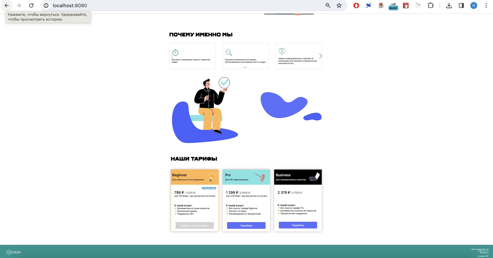
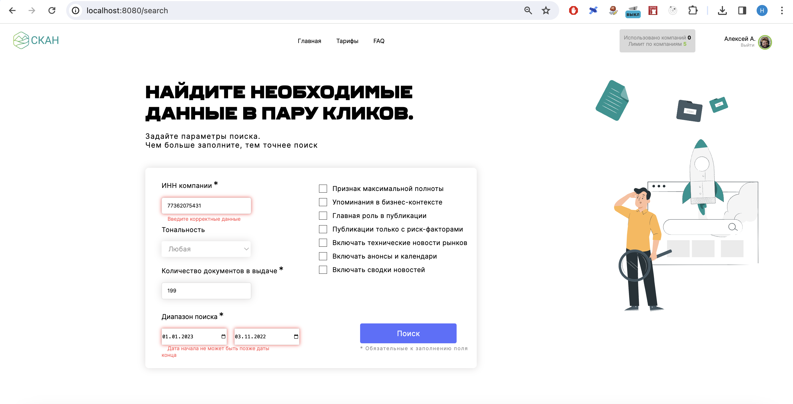

# О приложении СКАН

___

Компания «СКАН» помогает бизнесу формировать репутацию в интернете. Она предоставляет возможности не только мониторить СМИ и коммуницировать с журналистами, но и проверять своих контрагентов.

Именно из последней услуги и вырос проект, который вы реализуете.

Нанять подрядчика на проектную работу часто проще и дешевле. Ведь когда проект закончится, специалист может больше не понадобиться. Поэтому огромное количество бизнесменов не набирают штат из десятков сотрудников, а работают с независимыми профессионалами.

В такой ситуации неизбежно возникает проблема: как найти лучших?

Сами подрядчики расскажут в маркетинговых материалах о себе только хорошее. А что в действительности? Кто ещё работал с этими контрагентами и как они отзываются о выполненных проектах?

Есть запрос на получение такой информации. И «СКАН» его удовлетворяет. Так появился сервис поиска публикаций о компании по её ИНН.


___

## Установка приложения

```commandline
git clone https://github.com/molodcovnik/scan_project.git
npm install
npm build
npm start
```

___

### Главная страница приложения


___

### Главная страница приложения (продолжение)



___

### Форма поиска


___

### Невалидная форма поиска



___

### Страница с результатами поиска


___

### Страница авторизации пользователя


___

### Невалидная форма ввода данных пользователя


_____


### Логины и пароли


1. логин  sf_student7  пароль P6VcKNf
2. логин  sf_student9  пароль DTdEwAn

